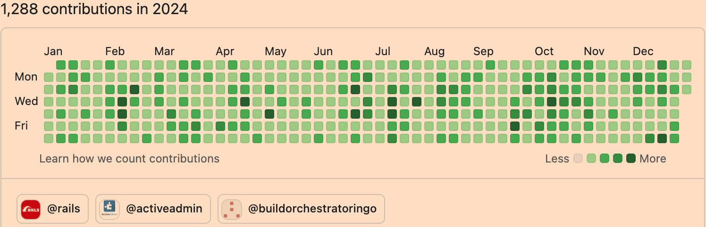

向来没有写年终总结的习惯，因为我一直觉得那是成功人士的专属。但今年我终于还是意识到要达到世俗意义上的成功，甚至可能是不可能的。世上的条条框框已经太多，又何必给自己徒增枷锁，所以真的写一篇年终总结应该也没什么可羞耻的。

## 一. 消费

我的 2015 款 MacBook Pro 不说不能用，但的确在打开多个标签页时有卡顿了，有时候圈圈会转好一会儿，而且升级系统也似乎存在困难。

于是 5 月份赶在国补之前强势购买了一台 8845HS 迷你主机，搭配原有的 Dell U2720Q 显示器，装上 Manjaro 系统，竟然有点完美。

11 月我又东拼西凑把它升级到了 32G + 2T 的配置，总共花费 4000 元左右。这彻底打破了我 “一万以下的电脑也能用？” 的封建残余思想。

## 二. 娱乐

自从英雄联盟手游上线已来，除了第一个赛季准备仓促止步钻石，之后的十个赛季我都上了大师段位，而最近的三个赛季都荣登宗师。

但限于自制能力太差，每次玩游戏都很难控制时长，联盟上线至今我的游戏场次已经接近一万场，所以最近一年我更多的是在不停的卸载但又很快重装它。还不错的是，最近一次卸载已经是两个月之前了。

2025 年的目标之一是不再玩英雄联盟，这有两个原因：一是随着学习的知识越来越多，我发现自己不知道的知识似乎比从前更多了许多；二是我在英雄联盟的水平已经很难取得进步，无论打野还是射手几乎都是依靠惯性思维走相似的路线，做雷同的操作，在细节和思路上都已经无法进一步突破自己。

除此之外，随着当前影视剧里的面孔越来越陌生，学习之余也重温了很多《铁齿铜牙纪晓岚》这样演技罕见的老电视剧和林正英那些曾给童年的我带来巨大阴影的电影，在短视频和碎片化文字漫山遍野的今天，我似乎找回了久违的旧时光。

## 三. 学习

今年随心所欲的学了很多知识，现在回想起来大都无用，也都忘了，但过程却是一种不错的经历。

鉴于一直想找一份远程开发的工作，而区块链似乎机会较多。我学习了如何用 Go 实现了比特币区块链，对相关生态做了一些了解，弄清了这个方向大概就是在以太坊、币安链这样的公链或是一些私有链上做开发，这是一个已经有点拥挤的环境了，而且这些链上存在的很多问题比如交易费和效率，早已旷日持久，远非我能解决的范畴。

之后我稍微尝试了一些合约开发， Solidity 这个几乎复刻 JavaScript 的语言写起来并不复杂，而合约部署到链上看起来也有点简单，但合约本身的严谨性使得出现任何差错都很难弥补，而合约的修改也许并不会很频繁，所以一般情况下还会涉及钱包、链上或是其他未知东西的开发（纯属猜想）。

我又看了 《Understanding DeFi》，书里充斥着令人眼花缭乱的名词，满满的写的都是未来，我现在只记得区块链解决了会计行业的三方记账问题。刚买了《权益证明》还没来得及拆塑封，就听说 V 神现在只顾泡妞自甘堕落了，社区要完了。

随后我看到那些数字游民、独立开发今天开着房车周游全国，明天穿着花裤衩在普吉岛的海滩上敲着残缺不全的 TS，这不就是我梦寐以求的生活吗？

所以我又花了点时间学习  Flex/Grid 布局和现代 CSS 里的花哨语法，为了了解 JavaScript 生态，还系统学习了 Astro。但慢慢觉得似乎哪里还是不够，后来明白了缺失的一环正是如何做设计？正当打算再学点 Figma，我忽然意识到：即便学会了设计工具，我也没有灵感来指导自己具体要设计什么。

所以我缺的不是技术，而是想法。而回顾这期间我无数次在累了倦了的时候回到 Ruby，我明白自己可能只是想单纯地做一份 Ruby 开发的工作。

此外，今年我在 GitHub 保持了全年不间断提交，尽管有些时候没什么要事仅仅更新了 README。也第一次参与了开源，被 Rails 合并了一个 PR，尽管只是对文档的一点修正。

## 四. 工作

年初的时候觉得还是应该找一份工作养家糊口。但如今日暮途穷的形势下想在国内找一份 Ruby 开发的岗位，属实是飞蛾扑火，和自己过不去了。在 Ruby China 上寥寥无几、薪水微薄的招聘帖子中零星投过几个简历，有过两个一面之后再无下文的面试，我就放弃了这条近乎穷途的末路。

面试是一场似乎靠实力，但多数时候却被运气夺主的修行。恰好问到的八股，是你早已熟稔的茴字有几种写法；原本一两天也解不出的算法，刚好在 LeetCode 上刷过；被上家公司拒绝的同样一番说辞，成了下一次面试中的白月光。

之后你加入一家公司，在那份年久失修的文档里蹒跚了一个上午，似乎只差拼多多的最后一刀就能在冰冷的 MacBook 上重建他们弱不禁风的开发环境。但随后便接到了产品经理从无数个竞品里借鉴、杂烩糅合而成的四不像。经过一整个下午热烈而低效的需求评审和排期会议， 你口干舌燥地冲上两袋麦斯威尔，从前台扒出那份余温未凉的国潮双拼饭，在会议室里一边狼吞虎咽，一边思考着接口如何实现。

已经是夜晚十点了，同事们似乎有人起身先行一步，你也终于鼓起勇气背上早已油光满面的黑色双肩包走出 SOHO 大厦。

**望京街的灯火依然亮的刺眼，而松兰堡村还是那么遥远；零下十八度的夜空下，盛满了层层叠叠的人间孤客**。

一周过去了，不堪重负的代码在一次又一次的测试反馈后被不断地缝缝补补，居然真的似乎也许可以上线了。有那么一瞬间，你甚至花了点时间短暂的吁了一口气，但又极快地投入到了下一个四不像的需求中。

偶尔，你像忽然想起了些什么，看向窗外那一方一成不变永远灰暗的天空，几朵破棉絮似的阴云肆无忌惮的组合着、嘲弄着，像极了你一身抱负却永远没有机会实践的 TDD。

“下次吧，下次一定把单测补上”。

两年过去了，也许是三年四年过去了，单测还没有补上，而你居然已经到了三十岁。你觉得自己还很年轻，但你大约的确是老了。

三十岁的你比二十二岁的小王老了八岁，在一切都日新月异的今天，至少是在编程上，这几乎就是一代人的差距。不过是些 CRUD，哪怕是条狗趴到键盘上，也能敲出个子丑寅卯来。何况这么多年，他们忽然发现你虽然没有涨过薪，但工资似乎依然比小王高，你像超市里隔夜的蔫茄子，像多年后今天的小王，没有了性价比。

廉价而充满活力的小王取代了昂贵而年老色衰的你。你试图和他们理论应得的 N+1，以及临近春节的年终奖。但你很快就知道这一切都是徒劳的，豢养多年的 HR 和法务团队是为你这样胆敢恶意讨薪的刁民量身打造的利器，凶恶的獠牙撕裂往日多年的温情，一口一口吞噬掉无数个加班的夜晚，让一切法律都成了一纸空文。你的离职证明上甚至用粗体写上了考核不合格，猩红色的印章像无赖的鬣狗带着阵阵腥臭飘荡到楼外红旗下的血盆大口。

你知道如果花些时间仲裁，你完全可以得到一份合规合法的赔偿和离职证明，然而届时你拿到的只是原本就属于你的东西，而他们不会付出任何代价。想到这些你真的累了倦了不想折腾了，多年来颠沛流离，你突然有点想回家了。他们又赢了，当然还会在这片土地上继续赢下去。

“**仰众妙而绝思，终优游以养拙**”，春耕秋收，而我所以又在田间地头赋闲了一年。

## 五. 2025

过去一整年无头苍蝇似的盲目探索，让我对 2025 年有了一个更清醒的认识，我知道自己想学什么、想要什么、想走什么路。已经学了太多应用和框架层面的知识，是时候在底层更进一步了。

但也终归是要养家糊口的，所以还是要，至少先要找一份工作。所以 2025:

- 要刷一些 LeetCode，学一些系统设计。
- 要更深入地学习 TCP/IP 协议和数据库。
- 要继续精进 Ruby/Rails，坚持 Hotwire。
- 要学习优秀 Rails 项目源码，尽力参与开源项目。
- 要继续投入到 Elixir/Phoenix/LiveView。
- 要深入学习 Vanilla JS。
- 要至少上线一个 Rails 应用。

AI 的狂潮像极了许多年前的元宇宙，一样的火热一样的势不可挡。但无论谁是那个六耳猕猴，我都只想在自己的慢世界里、做个悟空。
