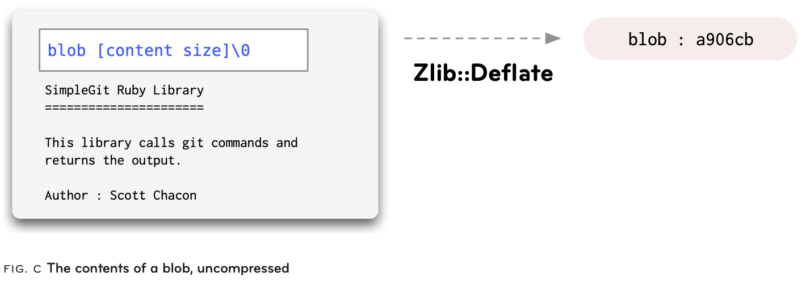
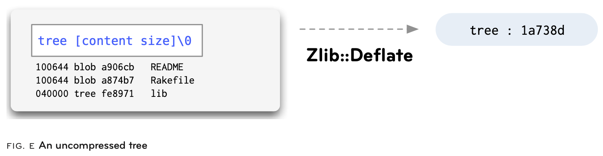
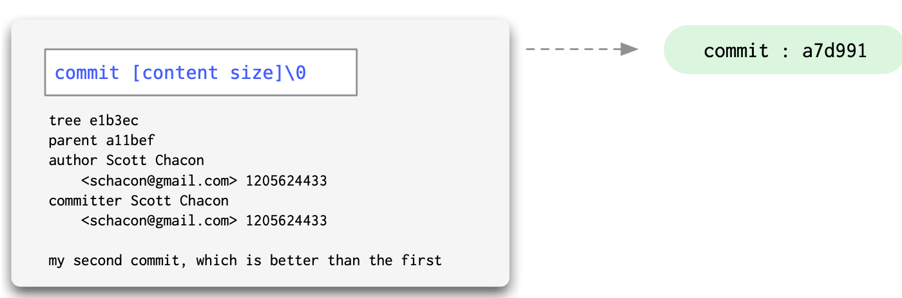
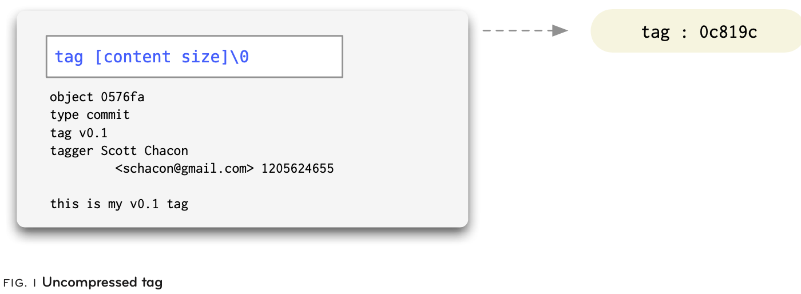
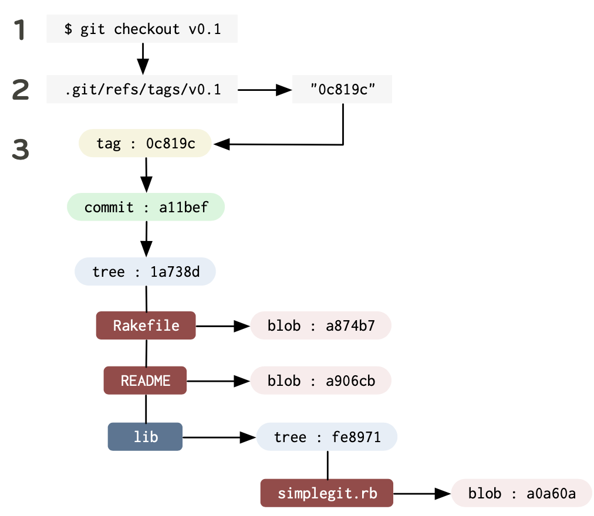

一直想了解 Git 的内部结构，但很多书都止步于命令用法的深浅细节，最近找到一本 08 年的 《Git Internals》，感觉言简意赅，短小精悍，颇令人惊艳；为便于复习，遂笔记一篇。

> 本文是出于自身学习、复习目的的简要性笔记，所以保留了大多数重要的术语，感兴趣的可以进一步阅读原书。

## 1. 简介

Git 是 Linus 为管理日益庞大的 Linux 内核代码而开发的版本控制系统，最初使用 Shell 和 Perl 脚本实现，之后出于可移植性和性能需要，逐步用 C 重写。它不存储内容变更的差异，而是存储完整的内容快照，然后在我们使用 `git diff` 之类的命令时再动态计算差异。 Linus 对 Git 的描述是：

> In many ways you can just see git as a filesystem - it's content-addressable, and it has a notion of versioning, but I really really designed it coming at the problem from the viewpoint of a filesystem person (hey, kernels is what I do), and I actually have absolutely zero interest in creating a traditional SCM system. - [Linus](https://marc.info/?l=linux-kernel&m=111314792424707)

Git 的设计目的是用于非线性、分布式协作开发，它的*分支 (branching)*、*合并 (merging)* 操作非常廉价 (即消耗资源极少)，且由于大部分操作都基于本地磁盘，不需要网络传输，所以速度很快；同时由于采用了多种压缩算法，仓库打包后的体积也很小，而通用的 Git 传输协议只传输已更改的对象的打包版本，不会尝试传输内容两次 (相同内容但不同文件名的文件也只会传输一次)，这些都进一步提高了网络传输效率。

Git 并不是一个真正的二进制文件，而是几十个专门的小程序的集合，与其说是一个程序，不如说它是一个*工具包 (Toolkit)*。这些工具可以大致分为两类：*porcelain* 和 *plumbing*。*plumbing* 命令偏低层，不是为了让人们直接在命令行使用，而是通过程序和脚本组合成 *porcelain* 程序。*porcelain* 命令隐藏了底层复杂性，是直接面向用户的接口。

## 2. Git 的对象类型

Git 对象是 Git 的实际数据，也是仓库的主要组成部分。它们都在 `.git` 目录内。每个对象都经过 Zlib 压缩，然后通过其内容的 SHA-1 值加上一个小的 header 来引用。SHA-1 值由 40 个字符组成，但一般我们只使用前 6～7 个字符即可引用它。

Git 对象主要有四种：

### 2.1 Blob

在 Git 中，文件的**内容**以 *blob* 存储，*blob* 只包含文件的内容，而不包含其文件名、权限位等元数据。可以通过一个简单的测试来验证：

1. 如果我们修改一个文件，即便只增加一个换行符，使用 `git status` 命令也会显示这个文件有修改
2. 但如果只是 `touch` 这个文件，`git status` 不会列出它

这意味着如果项目内的任何地方存在相同内容的两个文件，即使文件名不同，它们的 blob 也只会被存储一次。这也意味着在仓库被传输时 (clone 或 fetch)， blob 只会被传输一次。

Git 使用 Zlib 压缩 blob 对象的步骤如下：

1. **创建 blob 对象**：修改文件并执行 `git add` 命令时，Git 会创建一个新的 blob 对象来存储文件内容。
2. **压缩 blob 对象**：Git 使用 `Zlib::Deflate` 无损算法压缩数据，无损算法使压缩后的数据可以完全恢复到原始数据。
3. **存储压缩后的 blob 对象**：压缩后的 blob 被存储在 `.git/objects` 目录，以压缩格式存储，并使用其 SHA-1 哈希值作为文件名 (具体来说，哈希值的前 2 位作为目录名，后 38 位作为文件名)。
4. **解压缩 blob 对象**：当需要访问 blob 对象时，Git 会自动解压缩。

> 看到这里我其实有一个疑问：Git 把内容存储为 blob 对象，并使用哈希值作为文件名，那么它是如何查找文件的？不可能是通过遍历文件、求其哈希值对比吧？问了 AI 之后得到下面的答案 (仅参考)：

Git 使用基于哈希值的索引查找，具体步骤为：

1. Git 还维护着一个名为 `.git/objects/pack/pack-*.idx` 的索引文件，它记录了所有 Packfile 中对象的哈希值和偏移量。Packfile 是 Git 用于存储多个对象的压缩文件。
2. 当 Git 需要访问文件时，它先根据文件的哈希值使用前两位查找目录，然后在目录内查找与完整哈希值匹配的文件，如果文件存在，Git 会读取文件内容并解压缩它。如果不存在，Git 继续在 Packfile 中查找该对象。
3. 如果对象存在于 Packfile 中，Git 会使用索引文件找到该对象的偏移量，然后读取 Packfile 中对应位置的数据，并解压缩它。



### 2.2 Tree

在 Git 中，目录是以 *tree* 对象存储的，目录可以包含子目录和文件，所以 *tree* 当然包含着 *tree* 和 *blob*。

一个 tree 对象可以被认为是一个简单的文本文件，在未压缩前它的内容是由很多行组成的，每一行都包含四列：mode，type，sha-1，name。



### 2.3 Commit

从空间的角度看，blob 和 tree 对象分别存储文件和目录；从时间的角度看，“历史版本” 则是通过 *commit* 对象实现的。

commit 对象有点像 tree 对象，也可以被认为是一个文本文件，保存了一个 tree，以及 author，committer，message 和直接 parent 信息 (第一个 commit 没有 parent，则不保存此信息)。



> 大多数情况下，一个 commit 只有一个 parent，但如果一个 commit 是通过两个分支 merge 产生的，那么它就有两个 parent。
>
> 个人理解：Linux 中一切皆文件，Linus 开发的 Git 也可以被如此认为：所有的对象都是文件，只不过被压缩了。

commit 对象的 tree 是在执行 `git commit` 命令时，Git 对当前工作目录所做的一个快照。

### 2.4 Tag

Tag 对象为特定的 commit 提供永久的简写名称。它包含一个 object、type、tag、tagger 和 message。通常情况下，type 是 commit， 而 object 是被打 tag 的 commit 的哈希值。tag 可以使用 GPG 签名，为发布或版本提供加密完整性。



## 3. Git 的数据模型

在计算机科学中，Git 对象数据是一个 *有向无环图 (directed acyclic graph)*。也就是说，从任何 commit 开始，都可以沿一个方向遍历它的父对象，并且不存在以相同对象开始和结束的链 (没有环)。

所有的 commit 对象都指向一个 tree 或者一个之前的 commit；所有的 tree 都指向一个或多个 blob 或 tree。基于这个简单的模型，我们就可以快速有效地存储和检索无论内容如何变化的复杂 tree 的历史版本。

Git 中的对象是不可变的 (immutable)，例如，如果我们修改了一个文件，则会创建一个新的 blob 对象，而原文件的 blob 对象保持不变。除了不可变的对象之外，Git 中还存在*引用 (reference)*，与对象不同，引用可以不断变化。它们是指向特定 commit 的简单指针，有点像 tag，但很容易移动，如 branch，remote，HEAD。

当需要获取对象时，Git通过我们指定的 branch，tag 或 remote 从 `.git/refs/` 目录内获取初始哈希值，然后对 tree 进行遍历，获取名称列表中的所有 blob：



## 4. 分支 (branch) 和合并 (merge)

**Branch** 是存储在 `.git/refs/heads/` 目录内的文件，其内容是指向本分支最近的一个 commit 的哈希值。从一个分支创建新分支，就是创建一个具有相同哈希值的文件；而切换分支就是让 Git 使工作区的内容变更为 branch 的哈希值的 tree，即修改 `.git/refs/heads/[current_branch_name]` 中的哈希值为分支最后一次 commit 的哈希值，同时也要更新 **HEAD** 文件。

> 廉价的内联分支是一个真正使 Git 与众不同的特性，一旦习惯了它，它可能会改变我们对开发代码的看法。
>
> Creating a branch is nothing more than just writing 40 characters to a file.

**Remote** 是一个指针，指向同一存储库的其他人副本中的分支，通常是在远程计算机上。通过 `clone` 而非 `init` 获得的存储库，在默认情况下会产生一个添加了 `origin` 的 remote 分支，即 `origin/master`。

> `fetch` 从远程存储库中提取我们本地尚未拥有的所有 references 和 objects。如果远程仓库有一个 *idea* 分支，那么我们会得到一个 *origin/idea* 分支。
>
> 默认添加 *origin*，但可以任意命名，且可以有多个 remote。

如果我们的 commit 很多都是通过 merge 来的，而没有任何可共享的更改，那么这会使 commit log 很杂乱，**rebase** 就是解决这个问题的：基于一个我们选定的点 (commit) 进行 rebase 操作，可以使我们的所有更改直接附加到这个点之上，就像我们是直接在从这个点上切出的分支上进行修改的。

> rebase 直接应用我们的更改，使用我们原来的提交信息产生新的 commit，使得旧的 commit 变成孤儿对象，最终被垃圾回收。所以，我们应该只在推送之前的本地分支上执行此操作，或者在没有其他人可以获取访问权限的存储库上执行此操作，避免使他人的本地对象成为孤儿。

## 5. Treeish

除了 branch heads 之外，还有许多简便的方法来引用 Git 数据存储中的特定对象。这些通常被称为 **Treeish**。任何以对象(commit、tree 或 blob) 作为参数的 Git 命令都可以使用这些简化版本之一。

下面列出一些用法，可以进一步参考 [rev-parse](https://mirrors.edge.kernel.org/pub/software/scm/git/docs/git-rev-parse.html)。

```bash
# 1. 引用完整哈希
dae86e1950b1277e545cee180551750029cfe735

# 2. 引用部分哈希 (前 6～7 个字符)
dae86e

# 3. 引用 branch 或 tag 名称
# `.git/refs/heads` 和 `.git/refs/tags` 目录内的都可以用作 commit 的引用
master

# 4. 使用日期引用 (特定于本地仓库，由 `.git/log` 内的文件决定)
master@{yesterday}
master@{1 month ago}

# 5. 使用顺序引用 (特定于本地仓库，由 `.git/log` 内的文件决定)
master@{5} # master 分支的第五个历史版本

# 6. 插入符号父提交引用 (caret parent)
# 一个 commit 可能有多个父提交，^ 表示第一个父提交，^2 表示第二个，...
# 这种方法只对有多个父提交的比较有用，一般用 ~
e65s46^2
master^2

# 7. 波浪号引用 (tilde spec)
# 表示第 n 个祖先，这个应该是我们最希望用的
e65s46~5 # 等价于 e65s46^^^^^

# 8. tree 指针
# 指向指定 commit 的 tree
e65s46^{tree}

# 9. blob 引用
# 对于引用某一个 commit 或 tree 之下的特定 blob 非常有用
master:/path/to/file
```

## 6. Git 目录

初始化 Git 存储库时，无论是通过 clone 还是 init，Git 要做的第一件事就是创建 `.git` 目录。这是存储所有 object、tag、branch、hook 等数据的目录。Git 永久存储的所有内容都放在这个目录中。它是 Git 的灵魂。

可以通过 `GIT_DIR` 环境变量修改 Git 目录位置，甚至可以不把它放在项目内，而是集中存储到一个地方，然后在切换项目时指定 `GIT_DIR` 来使用。

Git 目录内容大致如下：

```bash
tree .git -L 1

.git
├── COMMIT_EDITMSG
├── FETCH_HEAD
├── HEAD
├── ORIG_HEAD
├── config
├── description
├── hooks
├── index
├── info
├── logs
├── objects
└── refs
```

- `.git/config`
  - Git 的配置文件
  - Git 加载配置的顺序依次是：`.git/config`，`~/.gitconfig`，`/etc/gitconfig`
- `.git/index`
  - Git 的默认索引文件
  - 可以通过 `GIT_INDEX` 环境变量覆盖 (对于一些临时的 tree 操作有用)
- `.git/objects/`
  - Git 对象的存储目录
  - 通过哈希值存储，哈希值的前 2 位作为子目录，后 38 位作为文件名
- `.git/refs/`
  - 通常包含三个子目录：`heads` (branch 文件)，`remotes` (remote branch 文件)，`tags` (tag 文件)
  - 文件内容是 commit 的哈希值
- `.git/HEAD`
  - 保存对当前工作分支的引用，告诉Git使用什么作为下一次提交的父对象
  - 内容大致为：`ref: refs/heads/master`
- `.git/hooks/`
  - 包含执行完 Git 命令之后需要调用的 Shell 脚本

## 7. 工作目录 (Working Directory)

重要的是要知道：工作目录的代码只是 Git 版本库代码的副本，它本身并不重要，即便修改或删除工作目录的文件，也可以随时被恢复。这也是为什么 Git 要求我们必须 commit 修改之后才可以切换到别的分支，因为 Git 需要保证它能够回到切换前的状态，如果没有 commit，就意味着 Git 未保存这些状态，因而也就无法恢复它们。

> 工作目录只是临时的。

## 8. 索引 (Index)

Index 有一段时间被称为 cache，因为这就是它的主要作用。它是一个临时区域，用于保存对尚未提交到存储库的文件或 tree 所做的更改。它充当工作目录和存储库之间的中间地带。当运行 `git commit` 时，resulting tree 和 commit object 都是基于 Index 的内容而构建的。

理解 Index 的关键点：

1. **Index 是一个文件**：虽然被称为“区域”，但它实际上是一个名为 `.git/index` 的二进制文件，存储了要提交的文件列表、状态信息以及指向文件快照的指针。
2. **Index 是暂时的**：commit 之后，Index 中的内容被用来创建新的提交快照，之后可以清空 Index，为下一次提交做准备。
3. **Index 可以查看和操作**
   1. `git status` 查看 Index 状态
   2. `git add` 添加文件到 Index
   3. `git reset` 从 Index 中移除文件
