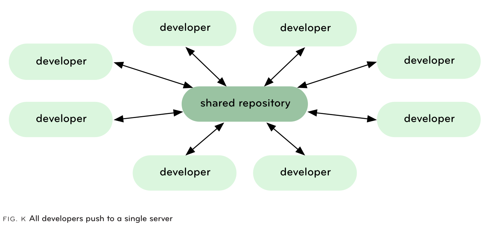
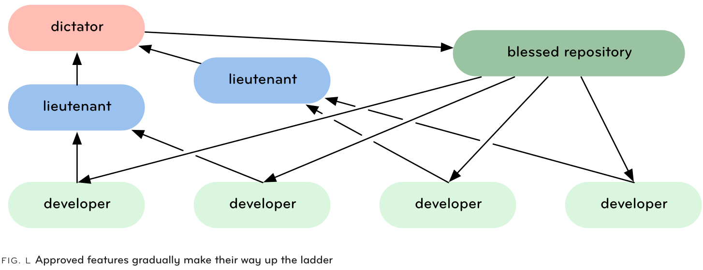
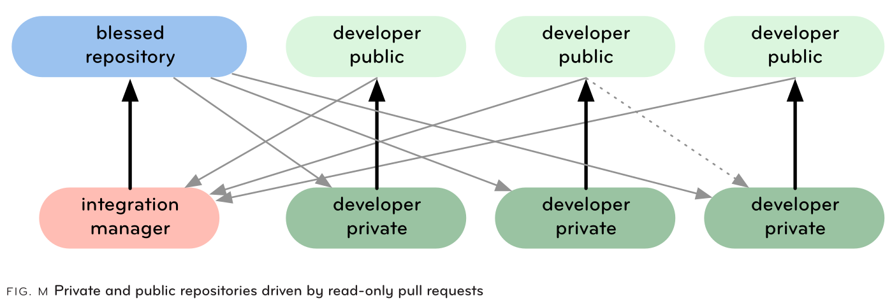

本文依然来自《Git Internals》的阅读笔记。虽然题目是“基本用法”，但事实上概括了 Git 使用的方方面面，一些个人感觉不大常用的命令只作简要记录，待用时查阅。

## 1. 配置

Git 的每一个 commit 都需要和提交者的姓名、邮箱相关联，有两种配置方式：

- 全局配置，使用 `--global` 参数，写入配置文件： `~/.gitconfig`
- 单个项目配置，不使用 `--global` 参数，写入配置文件： `.git/config`

```bash
git config --global user.name "Your username"
git config --global user.email "your-own-email@gmail.com"
```

除了命令外，直接编辑配置文件也是可以的。

## 2. 获取 Git 仓库

有两种获取 Git 仓库的方式： `clone` 现有仓库或 `init` 一个全新的仓库。

```bash
# 创建全新仓库，在目录内执行以下命令，会在当前目录内创建一个空的 .git 目录
# 然后我们就可以开始使用 `git add`, `git commit` 添加文件
git init

# 克隆现有仓库意味着创建一个别的仓库的完整副本，包括其所有的提交历史和分支
# 这需要一个被克隆仓库的 URL，可以是 HTTP、HTTPS、SSH 或 Git 协议之一
git clone git://github.com/schacon/simplegit.git

# clone 到指定目录
git clone git://github.com/schacon/simplegit.git my_directory
```

> `clone` 是一个完整的备份，和被克隆的仓库没有任何区别。

## 3. 常规 Git 流程

在开发中，我们经常希望 Git 自动忽略某些文件，通常是某些自动生成的文件，我们可以把匹配这些文件的模式添加到 *.gitignore* 文件中，以告诉 Git 我们不希望它跟踪他们。

然后我们进行开发并定期提交更改。查看要提交的内容 (即 *index* 中的内容) 的一个好方法是使用 `git status` 命令。

以下是添加文件到 index 并提交的命令：

```bash
# 添加单个文件
git add Rakefile

# 添加本目录内的所有文件
git add .

# 添加所有文件并提交
git add -a -m "commit all changes"
```

> - `git add`: working directory -> index
> - `git commit`: index -> repository
> - `git commit -a`: working directory -> respository
> - 不使用 `-m` 参数会使 Git 打开 `$EDITOR` 指向的编辑器，强制我们添加 commit message
> - 开发过程中的循环： modify -> add -> commit

如果我们同时修改了太多东西，但并不想一次性提交，而同时也不记得哪些文件的哪些修改是我们想提交的，那么可以使用 *交互式添加 (interactive adding)*，它允许我们在 commit 之前交互式地修改 index：`git add -i` (交互式中的数字 *2* 会列出我们可以更新的文件， 我们可以选择列出的文件前面的数字来添加相应的文件)。

如果一个文件中有多处修改，交互式 shell 甚至可以使我们只添加这个文件的一部分修改 (*patch* 选项)。

如果我们想删除一个已经添加的文件，可以使用 `git rm <filename>` 命令，此命令会**同时从 index 和工作目录**中删除指定的文件。

## 4. Log

随着时间的增加，我们的仓库有了越来越多的提交记录，那么该如何查找它们呢？

`git log` 命令可以查找几乎所有我们想了解的有关提交记录的信息，且由于这些信息都存储在本地，所以查找速度非常快。

下面是此命令的一些常用选项和解释：

```bash
# 显示所有提交记录，以时间倒序排列
# 如果有多个父提交，则按日期交错排列
git log

# --pretty 选项用于格式化输出
# 可接受参数： oneline, short, medium, full, fuller, email, raw, format(:string)
# ex: -format:"%an added %h on %ar"
git log --pretty=oneline
git log --pretty=format:"%an added %h on %ar"

# -n 选项用于指定要查找的最大记录数量
# --since 和 --until 用于限制查找的日期范围
git log -n 30 --since="1 month ago" --until=yesterday --author="schacon"
```

## 5. 查看 Git 对象

Git 提供了许多低级工具，使我们可以查看仓库、检查任何对象的状态和内容，有助于检查和调试。

`git show` 命令以人类可读的格式输出对象。在 blob 上运行此命令输出文件内容；在 tree 上运行此命令输出 tree 所包含的文件名，但不显示 subtree；它最重要的用途是查看 commits。

```bash
# ================== show commits ========================
# 在 commit 对象上调用，除了 autor 等信息外，还会展示此 commit 和其 parent 的 diff
git show master

# ================== show trees ========================
# 查看 tree 对象时，使用 ls-tree 命令比 show 命令更好
# 因为它会列出 tree 所包含的所有的 blob 和 tree 的 哈希和文件名
git ls-tree master

# 可以使用 `-r` 递归展示 subtree 所包含的 blob 信息
# `-t` 使得 subtree 本身也会被展示
git ls-tree -r -t master^{tree}

# ================== show blobs ========================
# cat-file 命令可以展示单个 blob 的信息，可以使用 -t 或者 -p 选项
git cat-file -t 29a422 # tree
git cat-file -p 29a422 # 100644 blob e69de29bb2d1d6434b8b29ae775ad8c2e48c5391	.keep

git cat-file -p e69de2
```

使用这几个命令，我们可以方便地查看 Git 仓库中的所有对象。

除了命令之外，Git 还有两个图形界面可以用于查看仓库内容：

- [`gitk`](https://git-scm.com/docs/gitk/)
  - 非常受欢迎的基于 Tcl/Tk 的浏览器
  - 可以使用大多数 `git log` 的参数选项，如 `--all`，`--since`，`--until`，`--max-count` 等
- [`git instaweb`](https://git-scm.com/docs/git-instaweb)
  -  使用 lighttpd，apache 或 webrick 启动运行 GitWeb CGI脚本的 Web 服务器。然后，它自动启动默认浏览器并将其指向新服务器
  -  `git instaweb --httpd=webrick`, `git instaweb --stop`

## 6. 查找 Git 对象

Git 提供了一种通过 tree 搜索对象的方法，且不用切换到相应分支。它类似 Unix 的 `grep` 命令，不同之处在于 `grep` 需要 files 作为参数，而 `git grep` 需要 trees 作为参数。

```bash
# 在版本 1.0 和 1.5.3.8 中，查找所有包含 "log_syslog" 字符串的 C 文件
# 可以列出任意多的 tree
git grep -n 'log_syslog' v1.5.3.8 v1.0.0 -- *.c

# 列出哪个文件不包含字符串 git
git grep -L -v git v1.5.3.8 v1.0.0
```

## 7. Git Diff

Git 提供了强大的 diff 工具，可以比较任意给定的 tree 对象、工作目录或 index 的两两组合。两个常见的用途是查看修改了但尚未提交的内容；以及创建一个 patch 文件通过 email 发送给别人。

```bash
# 不提供参数，会展示当前工作目录和 index (即上次 `git add` 到索引的内容) 之间的 diff
# 注意，只会比较工作目录中已经被追踪的文件，新建的文件不会被比较
git diff

# 还可以使用 diff 显示差异的数量
git diff --numstat a09caff..bc87349

# 一个 commit 和当前 HEAD 的 diff
git diff --stat bc87349..

# 指定特定文件的差异
git diff a09caff..bc87349 -- README.md
```

`git diff` 的输出是一个有效的 patch 文件，如果我们把结果重定向到一个文件，那么这个文件可以被用于 `patch` 命令。

```bash
git diff master..experiment > experiment.patch

patch -p1 < ~/experiment.patch
```

## 8. 分支 (Branch)

```bash
# 创建并切换到新分支有两种方式
# 1. 
git branch newfunc; git checkout newfunc
# 2. 切换到一个不存在的分支并用 `-b` 参数告诉 Git 你想创建它
git checkout -b newfunc

# 检查当前所在的分支
git branch
```

## 9. 合并 (Merge)

```bash
# 把分支 newfunc 合并到当前分支
git merge newfunc

# 删除已合并的分支
git branch -d newfunc
```

两个分支合并时可能会出现文件内容冲突，Git 留给我们自己解决。手动解决冲突后照常使用 `git add`，`git commit` 提交。

如果在合并过程中发现冲突，我们想撤回合并操作，将工作目录和 index 恢复原样，则使用 `git reset --hard HEAD` 命令。此命令默认情况只会恢复 index，但已合并的工作目录文件会保持合并冲突状态，使用 `--hard` 使得工作目录和 index 都恢复。

如果我们不小心进行了合并并提交，可以使用 `git reset --hard ORIG_HEAD` 恢复到最近的上一次提交。如果想恢复到上几次之前的提交，可以考虑 `git revert` 命令，这个命令有点危险。

## 10. Rebase

Rebase 是 merge 的一种替代方法，它把我们自切换分支以来的所有修改添加到当前 rebase 的分支上，但作为新的 commit，这些修改原来的 commit 对象被丢弃。假设我们在 *story84* 分支上执行 `git rebase master`，那么 *story84* 从 *master* 分支切换出来之后所做的修改都会以当前的 *master* 为基础并附加到其上 (因为 *story84* 从 *master* 分支且过来之后，*master* 分支继续前进，有了新的更改，与之前的 *master* 已不相同)。

Rebase 过程中会产生冲突，有三种可能的解决方案：

- 解决冲突： 执行 `git add`，`git rebase --continue`
- 放弃 rebase 操作，回到原来的状态： `git rebase --abort`
- 丢弃本次修改： `git rebase --skip`

类似于提交之前使用 `git add -i` 对 index 所做的交互式修改，Git 也提供了交互式 rebase：`git rebase -i` (*squash* 表示把当前 commit 和前一个 commit 压缩成一个 commit)。

> `rebase` 是 Git 工作流中最有用和最独特的命令之一。

## 11. Stash

Stash 是一个很简单的概念，而且非常有用。假设你正在当前分支上开发，突然生产分支出现了问题需要修复，但你还并不想提交当前的工作内容，此时可以使用 `git stash`，此命令会把从上次 commit 以来工作目录的所有修改临时存储起来，使我们可以切换到别的分支，之后再回到此分支恢复暂存的内容。

```bash
# 暂存所有修改
git stash

# 列出每一次暂存
git stash list

# 查看某个暂存的内容
git stash show stash@{1}

# 任何用到 tree 上的命令都可以用到 stash 上
git diff stash{1}

# 恢复暂存内容
git stash apply stash@{1}

# 如果不指定暂存引用，默认会使用最后一次暂存的内容
git stash apply
```

## 12. Tag

在 Git 中，创建一个 tag 和创建一个分支很相似，tag 就是用字符串给一个分支创建一个名字，这个字符串永远指向创建时这个分支的 commit，不会被修改。

```bash
# 下面的命令创建一个 tag 对象，存储在 `.git/objects/` 目录内，然后在 `.git/refs/tags/v0.1` 中
# 创建一个指向这个对象的永久引用
git tag -a v0.1 -m 'this is my v0.1 tag'

# 轻量级 tag (lightweight tag)：只在 `.git/refs/tags/` 目录内创建引用，不创建 tag 对象
# 此时的引用是当前 HEAD commit 的哈希值，而不是指向 commit 的 tag 对象的哈希值
# 这很容易被修改，一般我们不希望采用这种方式
git tag v0.1

# 可以采用 GPG 密钥签名 tag
# 用 `-s` 替换 `-a` 参数会c创建一个 tag 对象并使用当前用户的 email 对其进行签名
git tag -s v0.1 -m "my tag"
# 可以用 `-u` 指定自己的密钥
git tag -u <key-id> v0.1 -m "my tag"
# 之后，其他人可以用 `-v` 进行验证
git tag -v v0.1
```

## 13. 导出 Git

如果我们想创建一个代码的发布版本，或者向非 Git 用户分享某个 tree，可以使用 [`git archive`](https://git-scm.com/docs/git-archive) 命令。

可以创建 `tar` 或 `zip` 格式的导出，默认为 `tar`；使用 `--prefix` 指定导出目录。

```bash
git archive --prefix=simplegit/ v0.1 | gzip > simple-git-0.1.tgz
# 使用
tar zxpvf simple-git-0.1.tgz

# 还可以只导出仓库的一部分： 下面命令导出 master 的第一个父分支的 lib 目录
git archive --format=zip master^ lib/ > simple-git-lib.zip
# 使用
unzip simple-git-lib.zip
```

## 14. Git 的维护

随着时间的增加，需要对 Git 仓库作出一些*维护与保养 (care and feeding)*，使其保持健康和快速。

```bash
# `gc` (garbage collection) 命令是一个很重要的命令，它把对象打包成 delta-compressed 格式，
# 帮助我们节省大量空间，提高其他命令的运行速度
git gc
# 可以自动开启或关闭此命令 (1, 0)
git config --global gc.auto 1

# 检查仓库的健康度: 检查是否存在不可抵达或损坏的对象，并帮助我们修复
git fsck

# 清理不可不健康的对象
git prune 
# 可以先使用 -n 看一下 Git 会做什么
git prune -n
```

## 15. 分布式工作流程

### 15.1 Clone

Clone 操作支持许多协议，包括 local，HTTP，HTTPS，SSH，Git 以及 Rsync。其中 Git 和 SSH 较为推荐因为它们的效率高，易于设置。

Clone 仓库时，Git 把所有对象都拷贝到一个指定的新目录，并切换到一个和远端的 HEAD 分支名同名的本地分支，同时把远端的所有分支都保存在一个 remote reference 下 (默认为 `remote`)。

Local clone 是最简单的 clone 类型，它基本上就是拷贝一个 `.git` 目录，然后做分支切换。通常我们当我们想创建一个放到公共服务器上的裸仓库，或者想要创建共享仓库时会这样做：

```bash
git clone --bare simplegit/.git simplegit-bare.git
```

通过 SSH 进行 clone 要求在被 clone 的机器上有用户凭据，Git 传输没有这种验证，所以通常只用于 fetch 操作。

通过 HTTP 进行 clone 非常简单，无需任何设置，但因为它通过多次调用松散地传递对象和 packfiles，而不是把它们打包传输，所以比其他协议低效。

> Clone 是一次完整的备份，所以它不存在单点故障。

### 15.2 Fetch 和 Pull

Fetch 会沿用 Clone 操作使用的协议，从远端拉取所有对象和引用的更改，来更新本地的所有 `origin/[branch]` 分支。

但 `origin/[branch]` 分支更新后，我们大概率会向把这些更新 merge 到本地的 `[branch]` 分支，如果我们想自动这种更新和 merge 操作，可以使用 Pull，因此以下两行命令是等效的：

```bash
git pull origin/story84

git fetch origin/story84; git merge origin/story84
```

### 15.3 Push

我们可以把本地的 commit 通过 Push 操作同步到远端。

```bash
git push origin master

# origin 是默认值，所以可以被省略
# 但如果我们的 remote 是别的名字，或者我们打算 push 别的分支，则无法省略
git push scott-public experimental

# 如果不指定分支，则默认 push 所有本地和远端都存在的分支
git push scott-public
```

> 在 Git 中，Push 的反面是 Fetch 而不是 Pull；Pull = Fetch + Merge。

### 15.4 Multiple Remotes

Git 真正 “去中心化” 的地方在于： 不存在一个 “特殊” 的仓库，每一个仓库都是平等的；且代码库可以添加多个 remote。

```bash
git remote add mycap git@github.com/schacon/xxxx.git
git remote add official git@github.com/jamis/xxxx.git

# 当仓库有更新时，我们可以从一个远端拉取更新，在本地合并，然后推送到另一个远端
git fetch official
git merge official/master
git push mycap master
```

删除一个 remote 只会删除 `.git/config` 中的相应行以及 `.git/refs/[remote_name]` 目录中的引用，而不会删除任何对象，所以重新添加 remote 也会很快，因为要传输的数据很少。

可以使用 `remote show` 命令查看一个 remote 分支： `git remote show origin`。

### 15.5 可能的工作流

由于 Git 支持多 remote 的特性，所以有很多可能的工作流方式，以下列出三种，依次对应下方的三张截图：

- Central Repository Model
  - 没有单点依赖，但每个人都要及时更新自己的仓库
- Dictator and Lieutenant Model
  - Linux 内核采用这种方式
- Integration Manager Model
  - 开源社区如 GitHub 采用这种方式







## 16. 共享仓库

### 16.1 通过 Git

Git 自己的协议基本上就是 [`git-upload-pack`](https://git-scm.com/docs/git-upload-pack) 命令的包装器。手动开启可以使用类似下面的命令：

```bash
git daemon --detach --export-all --base-path=/opt/git /opt/git/ambition
```

由于 Git 协议没有授权机制，所以这种方式共享的仓库不能被 push，这种需求可以考虑 SSH。

### 16.2 通过 SSH

Git 可以完全通过 SSH 工作，它们所做的事情基本完全相同，只是 SSH 有权限验证。

一个 Git 仓库的远程部署流程：

```bash
# 1. 创建一个裸仓库，只包含 Git 版本控制信息，不包含工作目录和文件
git clone --bare

# 2. 将裸仓库复制到远程服务器
scp -r project.bare user@host:/repos/project.git

# 3. 从远程服务器 clone 到本地
git clone user@host:/repos/project.git
```

> 个人想法： 这种方式可以把 GitHub 和远程服务器都作为本地的 remote，本地推送代码同时保存到两个 remote。

Git 自带了 [`git shell`](https://git-scm.com/docs/git-shell/) 命令，一个只允许 Git 相关操作的 Shell。

### 16.3 通过 HTTP

不推荐通过 HTTP 进行 Push 操作，需要 DAV 设置，并且每次 commit 之后还需要执行 `git update-server-info` 命令 (可以把此命令添加到 server 上的 *post-commit* 脚本)。

## 17. 托管仓库

如 GitHub。

## 18. Git 命令分类总结

- 基础命令 (18)
  - `git config`
  - `git init`
  - `git clone`
  - `git add`
  - `git rm`
  - `git commit`
  - `git status`
  - `git branch`
  - `git checkout`
  - `git merge`
  - `git reset`
  - `git rebase`
  - `git stash`
  - `git tag`
  - `git fetch`
  - `git pull`
  - `git push`
  - `git remote`
- 查看仓库 (8)
  - `git log`
  - `git show`
  - `git ls-tree`
  - `git cat-file`
  - `git grep`
  - `git diff`
  - `gitk`
  - `git instaweb`
- 其他工具 (5)
  - `git archive`
  - `git gc`
  - `git fsck`
  - `git prune`
  - `git daemon`

> 其他参考资料
>   - [Git for Computer Scientists](https://eagain.net/articles/git-for-computer-scientists/)
>   - [A tour of git](https://cworth.org/hgbook-git/tour/)
>   - [30 Years Of Linux - An Interview With Linus Torvalds](https://www.tag1consulting.com/blog/interview-linus-torvalds-linux-and-git)