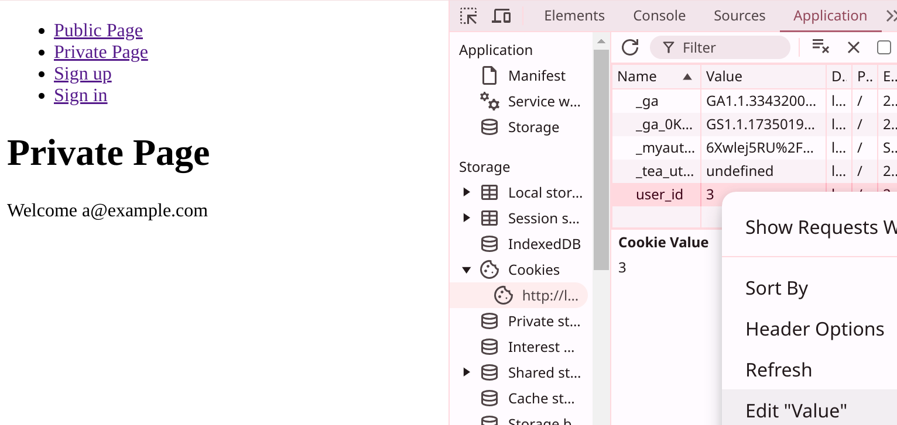

上篇文章实现了基本的注册功能，本文继续实现登录功能。这里的重点是理清整个流程，在此基础上更轻松地理解 Rails 8 提供的身份验证方案，从而可以添加适合自己业务的实现。所以需求依然很简单：

1. 用户访问 Private 页面会被重定向到登录页面
2. 输入无效的邮箱/密码组合，将停留在登录页面，并显示失败的 Flash 消息
3. 输入有效的邮箱/密码组合，将重定向到 Private 页面，并显示成功的 Flash 消息

## 1. 登录的样板代码

在讨论身份验证逻辑之前，依然是要先准备好登录相关的 Route、Controller、View 样板代码。登录的 Controller 名一般用 Session，且我们只需要呈现页面 (`new`)、处理登录请求 (`create`)，所以代码如下：

```ruby
# 1. config/routes.rb
Rails.application.routes.draw do
  # ...
  resource :session, only: %i[new create]
end

# 2. app/controllers/sessions_controller.rb
class SessionsController < ApplicationController
  def new
  end

  def create
    if user = User.authenticate_by(session_params)
      # 稍后添加登录逻辑
      redirect_to private_page_index_path, notice: "Logged in with #{user.email}"
    else
      flash.now[:notice] = "Invalid email or password"
      render :new, status: :unprocessable_entity
    end
  end

  private

    def session_params = params.expect(session: [ :email, :password ])
end
```

单数 `resource` URI 模式中没有 `:id` 参数，路由是 `/session` 形式；而 `resources` 路由是 `/sessions/:id` 形式，且稍后我们会把 Session Id 保存到 Cookie 中，所以这里没有必要使用复数。

`authenticate_by` 的逻辑是用邮箱查找用户，然后用 Bcrypt 对用户提供的密码进行哈希以和数据库中的 `password_digest` 进行比较，验证成功返回 `user` 对象，失败则返回 `nil`。它是 Rails 7.1 添加的身份验证方法，之前一般使用 `User.find_by(email: "...")&.authenticate("...")` 进行验证，它们的区别就是...总之 **`authenticate_by` 更安全**。

> Add authenticate_by when using has_secure_password - PR `rails#43765`：[https://github.com/rails/rails/pull/43765](https://github.com/rails/rails/pull/43765)
>
> Rails 7.1 adds authenticate_by when using has_secure_password：[https://blog.kiprosh.com/rails-7-1-adds-authenticated_by/](https://blog.kiprosh.com/rails-7-1-adds-authenticated_by/)

之后实现登录页面：

```ruby
# app/views/sessions/new.html.erb

<h1>Sign in</h1>

<%= form_with scope: :session, url: session_path do |f| %>
  <div>
    <%= f.label :email %>
    <%= f.email_field :email %>
  </div>

  <div>
    <%= f.label :password %>
    <%= f.password_field :password %>
  </div>

  <%= f.submit "Sign in" %>
<% end %>
```

因为 Session 没有 Model，所以这里 `form_with` 用 `scope: :session` 使表单字段可以嵌套在 `session` 为键的哈希中，组成 `{ session: { email: "xx", password: "xx" } }` 这种形式的参数，方便 `params.expect()` 方法访问处理。`scope` 选项是完全可选的，但它确实使 Controller 中的参数更加明确。

之后依然是在 `application.html.erb` 添加一个快速导航：

```html
<!-- app/views/layouts/application.html.erb -->

<li><%= link_to "Sign up", new_registration_path %></li>
<li><%= link_to "Sign in", new_session_path %></li>
<!-- ... -->
 ```

如果此时使用 `bin/dev` 启动服务，在浏览器中用之前注册的账户登录，成功失败都符合我们先前设定的逻辑。

## 2. 添加身份验证逻辑 (不安全)

一切就绪，现在可以实现登录逻辑了。我们先实现一个不安全的逻辑，然后再讨论如何改进。

### 2.1 使用 Rails Concern

成功验证用户账户后，首先要保持用户的登录状态，所以很自然地这里需要一个 `sign_in` 方法：

```ruby
# app/controllers/sessions_controller.rb

def create
  if user = User.authenticate_by(session_params)
    sign_in user # 添加这一行
    redirect_to private_page_index_path, notice: "Logged in with #{user.email}"
  else
    # ...
  end
end
```

`sign_in` 是所有身份验证相关的逻辑都需要的“共享”代码，Rails 为这种代码提供了 Concern 方案。Concern 是一个听起来有点陌生但其实就是一个自定义的用来**共享/组织 (share/organize)** 代码片段的模块。Rails 在 `controllers` 内预设了 `concerns` 目录，所以我们直接在这里创建一个身份验证相关的 Concern：

```ruby
# app/controllers/concerns/authentication.rb

module Authentication
  def sign_in(user)
  end
end
```

然后在 `ApplicationController` 中 Mixin 这个模块，使 `sign_in` 方法对所有 Ccontroller 当然也包括 `SessionsController` 都可用：

```ruby
# app/controllers/application_controller.rb

class ApplicationController < ActionController::Base
  include Authentication
  # ...
end
```

接下来首先实现一个不安全的 `sign_in`：

```ruby
# app/controllers/concerns/authentication.rb

def sign_in(user)
  cookies.permanent[:user_id] = user.id
end
```

用户成功登录之后，使用 `cookies` 方法把用户 `id` 存到 Cookie，之后每次 HTTP 请求浏览器都会自动把 Cookie 放到 Request Header 发送到服务器，这样我们就可以获取用户 `id` 并在数据库查找用户。`permanent` 方法设置浏览器中 Cookie 的有效期是 20 年。

下一步给 Private 页面添加强制身份验证：

```ruby
# app/controllers/private_page_controller.rb

class PrivatePageController < ApplicationController
  before_action :require_authentication
  # ...
end
```

然后在 Authentication Concern 实现 `require_authentication` 方法：

```ruby
# app/controllers/concerns/authentication.rb

module Authentication
  def sign_in(user)
    cookies.permanent[:user_id] = user.id
  end

  def require_authentication
    resume_authentication || request_authentication
  end

  def resume_authentication
    User.find_by(id: cookies[:user_id])
  end

  def request_authentication
    redirect_to new_session_path, notice: "You must sign in first!"
  end
end
```

`require_authentication` 首先利用 Cookie 中保存的 `id` 查找用户，如果找到就返回 `user` 对象，找不到则重定向到登录页面。注意这里使用 `find_by` 而非 `find` 是因为 `find_by` 找不到用户会返回 `nil`，这使我们可以继续执行重定向逻辑；而 `find` 查找失败会 Raise Error，不是这里需要的逻辑。

### 2.2 访问当前用户

用户成功登录之后，我们总是需要用用户信息做点什么，比如显示 “欢迎回来，xxx” 之类的消息，这需要 `user` 对象。`ActiveSupport::CurrentAttributes` 类提供了**在单个请求周期内的全局属性**，它的主要功能是：

1. **线程隔离**：每个线程都有自己的 `Current` 对象实例，属性值不会在不同线程之间共享，即用户 A 的全局 `user` 对象和用户 B 的全局 `user` 对象不会相互干扰
2. **自动重置**：每个请求的开始和结束，属性都会被自动重置，这确保每个请求都有一个干净的状态
3. **属性声明**：使用 `attribute` 方法声明属性会自动生成 *reader* 和 *writter* 方法

> Current attributes in Rails: [https://fullstackheroes.com/tutorials/rails/current-attributes/](https://fullstackheroes.com/tutorials/rails/current-attributes/)
>
> PR `rails#29180`：[https://github.com/rails/rails/pull/29180](https://github.com/rails/rails/pull/29180)
>
> Commit：[https://github.com/rails/rails/commit/24a864437e845febe91e3646ca008e8dc7f76b56](https://github.com/rails/rails/commit/24a864437e845febe91e3646ca008e8dc7f76b56)

所以如果我们查到用户后把 `user` 对象放到这个全局属性里，就可以随意访问它而不用显式传递参数：

```ruby
# app/controllers/concerns/authentication.rb

module Authentication
  def resume_authentication
    Current.user = User.find_by(id: cookies[:user_id])
  end

  # ...
end
```

Rails 的惯例是在 Model 中定义 `Current` 类：

```ruby
# app/models/current.rb

class Current < ActiveSupport::CurrentAttributes
  attribute :user
end
```

然后我们就可以在 View 中访问 `Current.user`，比如在 Private 页面显示欢迎消息：

```html
<!-- app/views/private_page/index.html.erb -->

<h1>Private Page</h1>
<p>Welcome <%= Current.user.email %></p>
```

此时用 `bin/dev` 启动服务，访问 `http://localhost:3000/private_page/index` 会被重定向到登录页，登录成功会跳转到 Private 页面并显示欢迎消息。

### 2.3 注册后自动登录用户

在进一步讨论之前，一个合理的用户体验改进是：**使用户注册后自动登录**。由于我们的 Authentication Concern 被 Mixin 到 ApplicationController，所以这个改进很简单：

```ruby
# app/controllers/registrations_controller.rb

class RegistrationsController < ApplicationController
  # ...

  def create
    @user = User.new(user_params)
    if @user.save
      sign_in @user # 添加这一行
      redirect_to private_page_index_path, notice: "Successfully registered!"
    else
      render :new, status: :unprocessable_entity
    end
  end
end
```

现在打开浏览器注册一个新用户，会自动跳转到 Private 页面并显示欢迎消息。

## 3. 当前实现的漏洞分析及改进措施

把用户 `id` 直接保存到 Cookie 看似达到了目的，但由于 `id` 本身是增量的，攻击者可以传递任意 `id` 值来获取不同用户的信息。我们自己也可以直接在浏览器的开发者工具里修改这个值：



### 3.1 第一次改进 - 增强 Cookie

要解决这个漏洞，需要确保 Cookie 的值不能被篡改。在本系列的第一篇文章中，我们知道**签名**是一种防篡改机制，这正是 Cookie 需要的。修改 Authentication Concern 以在用户登录后保存**被签名的 Cookie**：

```ruby
module Authentication
  def sign_in(user)
    cookies.signed.permanent[:user_id] = user.id
  end

  def resume_authentication
    Current.user = User.find_by(id: cookies.signed[:user_id])
  end

  # ...
end
```

> API 文档里的例子让 Cookie 的用法变得很清晰：[https://api.rubyonrails.org/classes/ActionDispatch/Cookies.html](https://api.rubyonrails.org/classes/ActionDispatch/Cookies.html)

现在再打开浏览器开发者工具，会发现 Cookie 变成了签名字符串，我们可以解码这个字符串的前半部分：

```ruby
payload, signature = "eyJfcmFpbHMiOnsibWVzc2FnZSI6Ik1RPT0iLCJleHAiOiIyMDQ0LTEyLTI0VDA3OjIwOjM1LjY3NVoiLCJwdXIiOiJjb29raWUudXNlcl9pZCJ9fQ%3D%3D--d6905a3f864a649815846d2242d5750632efb97d"

value = JSON.parse(Base64.decode64(CGI.unescape(payload)))
# => {"_rails"=>{"message"=>"MQ==", "exp"=>"2044-12-24T07:20:35.675Z", "pur"=>"cookie.user_id"}}

# 进一步解码得到 user id
Base64.decode64(value.dig("_rails", "message"))
# => "1"
```

所以虽然现在依然可以从 Cookie 里得到用户的 `id`，但由于整个 Cookie 的签名部分是唯一的，更改这个 `id` 值会使签名失效，从而使 Cookie 被拒绝。带有签名的 Cookie 大大增强了身份验证系统。 

### 3.2 第二次改进 - HTTP-only Cookie

但当前的实现版本仍然存在的一个问题是容易受到 XSS 攻击：如果攻击者利用恶意脚本窃取到用户的 Cookie，那么他们就能用这个 Cookie 冒充用户来执行操作。

在浏览器开发者工具里很容易使用 JavaScript 获取到 Cookie 信息：

```js
document.cookie.split(";").find(cookie => cookie.includes("user_id"))
// => 'user_id=eyJfcmFpbHM...'
```

要避免这个问题，就需要**让浏览器阻止 JavaScript 访问 Cookie，而只能通过 HTTP 协议访问 Cookie**，这正是 Cookie 的 `HttpOnly` 属性的天生功能。修改 Authentication Concern 的实现为：

```ruby
# app/controllers/concerns/authentication.rb

module Authentication
  def sign_in(user)
    cookies.signed.permanent[:user_id] = { value: user.id, httponly: true }
  end

  # ...
end
```

此时如果我们清除浏览器中的 Cookie，再次使用上面的 JavaScript 脚本尝试获取它，只会得到 `undefined`。

### 3.3 仍然存在的问题

似乎目前的实现挺不错了。但设想一个场景：**如果用户在一台公共计算机上登录了自己的账户，但没有退出就离开了，这时候我们如何让 Cookie 失效**？

Cookie 中是有效期 20 年的用户 `id`，而我们没有任何办法区分同一用户的不同 Cookie，所以我们无能为力。

### 3.4 第三次改进型 - 创建 Session Model

要解决这个问题，可以创建一个新的 Session Model。一个 User 有多个 Session，每次登录都创建一个新的 Session，然后把 Session Id 存到 Cookie 中，这样用户在不同的计算机上保存的 Session Id 就不同。

验证用户时，用 Session Id 查找关联的 User。而对于 Session 的管理，我们既可以提供一个页面让用户自行管理，也可以通过删除用户所有的 Session 记录来使所有 Session 都失效。

让我们先生成 Session Model：

```bash
bin/rails g model Session user:references

bin/rails db:migrate
```

再更新 User Model：

```ruby
# app/models/user.rb

class User < ApplicationRecord
  has_many :sessions, dependent: :destroy

  # ...
end
```

Session 需要在用户登录时创建，所以 Authentication Concern 需要更新：

```ruby
# app/controllers/concerns/authentication.rb

module Authentication
  def sign_in(user)
    session = user.sessions.create!
    cookies.signed.permanent[:session_id] = { value: session.id, httponly: true }
  end

  def resume_authentication
    Current.user = session_from_cookies&.user
  end

  def session_from_cookies
    Session.find_by(id: cookies.signed[:session_id])
  end

  # ...
end
```

这段代码很简单：当用户登录时，创建一个 Session 并把 `session_id` 保存到 Cookie。在需要身份验证的页面，我们从 Cookie 获取 `session_id` 进而获取关联的用户。如果你在浏览器试一下，一切都应该正常工作。

在实际的例子中，如 Rails 8 Authentication 生成的代码还在 Session 中保存了 User Agent、IP 等信息，这可以用来检测异常登录、辅助调试和分析或者提供个性化的用户体验。

## 4. 退出登录

### 4.1 实现

退出登录的实现相对简单，但仍然有一些需要小心的地方。我们先完成 Router 和 Controller 的代码：

```ruby
# config/routes.rb

Rails.application.routes.draw do
  # ...
  resource :session, only: %i[new create destroy] # 添加 destroy 路由
end 

# app/controllers/sessions_controller.rb

class SessionsController < ApplicationController
  # ...

  def destroy
    sign_out
    redirect_to root_path, notice: "You have been signed out."
  end
end
```

在 Authentication Concern 实现退出登录的功能：

```ruby
# app/controllers/concerns/authentication.rb

module Authentication
  # ...

  def sign_out
    session_from_cookies.destroy!
    cookies.delete(:session_id)
  end
end
```

在 `application.html.erb` 添加一个快速导航，注意这里使用 `button_to`：

```html
<!-- app/views/layouts/application.html.erb -->

<li><%= link_to "Sign in", new_session_path %></li>
<li><%= button_to "Sign out", session_path, method: :delete %></li>

<!-- ... -->
```

### 4.2 改进

似乎还可以，但：如果用户未登录就点击退出按钮，那么 `sign_out` 方法的 `session_from_cookies.destroy!` 会报错，所以在退出之前需要确保用户已经登录：

```ruby
# app/controllers/sessions_controller.rb

class SessionsController < ApplicationController
  before_action :require_authentication, only: :destroy

  # ...
end
```

同样，已经登录的用户也不能再次登录或注册：

```ruby
# app/controllers/sessions_controller.rb

class SessionsController < ApplicationController
  before_action :redirect_if_signed_in, only: %i[new create]

  # ...
end

# app/controllers/registrations_controller.rb

class RegistrationsController < ApplicationController
  before_action :redirect_if_signed_in, only: %i[new create]

  # ...
end
```

`redirect_if_signed_in` 自然是要在 Authentication Concern 实现：

```ruby
# app/controllers/concerns/authentication.rb

module Authentication
  # ...
  
  def redirect_if_signed_in
    redirect_to root_path, notice: "You are already signed in." if resume_authentication
  end
end
```

可以说现在的实现有点完美了。