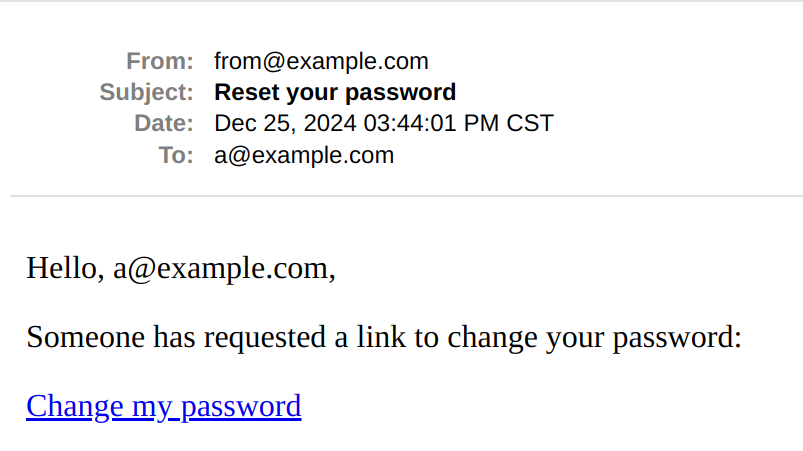
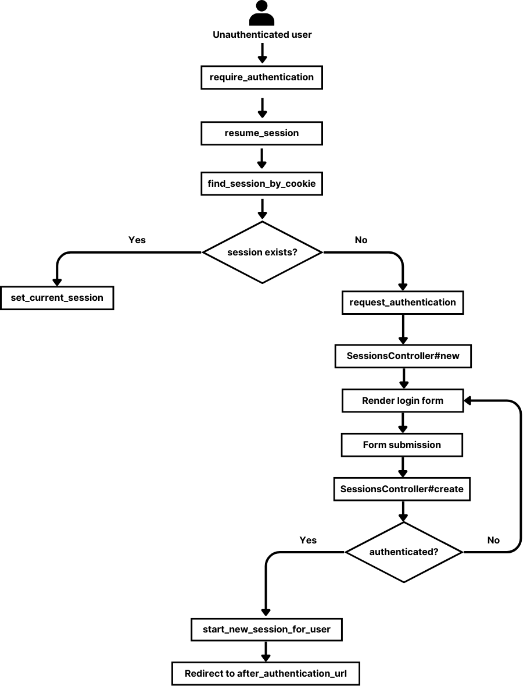

在前三篇文章的基础上，我们继续实现忘记密码和修改密码的功能，这些功能一起构成了一个基本的身份验证系统，甚至已经可以上线了。

## 1. 忘记密码

遗忘是人的本能，每个网站的登录按钮旁都有忘记密码的选项是科学的。它的实现可以拆成以下几步：

1. 在登录页添加忘记密码的链接
2. 用户点击链接，被重定向到输入邮箱的页面
3. 用户输入邮箱并提交，我们发送一个 Flash 消息并重定向到 Root 页面
4. **证明用户确实是他所输入邮箱的所有者**是极其必要的，所以我们向邮箱发送一个包含唯一 Token 的链接
5. 用户点击邮箱中的链接，链接带着 Token 跳转到修改密码的页面
6. 用户填写新密码，提交表单，同时 Token 作为隐藏字段被发送到服务器
7. 服务器验证 Token 是否有效，以确定下一步

### 1.1 准备样板代码

根据上面的步骤，首先要实现的是重置密码相关的 Router、Controller、View 代码。我们用 `new` 和 `create` 发送邮件，`edit` 和 `update` 更新密码，所以相关代码如下：

```ruby
# config/routes.rb

Rails.application.routes.draw do
  # ...
  resource :password_reset, only: %i[new create edit update]
end

# app/controllers/password_resets_controller.rb

class PasswordResetsController < ApplicationController
  before_action :redirect_if_signed_in # 不要忘了这一行

  def new
  end

  def create
    if user = User.find_by(email: params[:email])
      # 1. 生成一个唯一的 token
      # 2. 发送带有 token 的邮件
      redirect_to root_path, notice: "Email sent with password reset instructions."
    else
      flash.now[:notice] = "No user found with this Email"
      render :new, status: :unprocessable_entity
    end
  end
end
```

然后是输入邮箱的页面：

```ruby
# app/views/password_resets/new.html.erb

<h1>Password reset</h1>

<%= form_with url: password_reset_path do |f| %>
  <div>
    <%= f.label :email %>
    <%= f.email_field :email %>
  </div>

  <%= f.submit "Reset password" %>
<% end %>
```

不要忘了在登录页面添加忘记密码的链接：

```ruby
# app/views/sessions/new.html.erb

# ...
<%= link_to "Forgot passowrd?", new_password_reset_path %>
```

### 1.2 生成用于重置密码的唯一 Token

生成唯一 Token 的方法有很多，比如 Ruby 的 `SecureRandom` 模块：

```ruby
SecureRandom.base58(24)
# => "pNfa26c8XTmHHwNccLftya9x"

SecureRandom.uuid
# => "077a2ada-74fc-402a-bc00-78c1dfd34802"
```

但用这种方式生成 Token 需要做到以下两点：

1. 在发送 Token 之前要把 Token 保存到数据库，才能和之后用户传递的 Token 相比较
2. 存到数据库之前需要对 Token 进行哈希处理，这样数据库被攻击，攻击者依然无法更新用户的密码

这是一个可行但繁琐的过程。

#### 1.2.1 理解 `generates_token_for` (这部分代码仅用于说明，无需使用)

> 我想在这里更深入地讨论一下 `generates_token_for` 方法，以整理自己的思路。

一个更好的方法是使用 Rails 的 `generates_token_for`：**它生成用于特定目的的 Token**，如下：

```ruby
class User < ApplicationRecord
  # ...
  generates_token_for :password_reset
end
```

我们就可以给用户生成 Token，且可以验证它:

```ruby
user = User.first

signed_token = user.generate_token_for(:password_reset)

# 验证 token：成功则返回对象；失败则返回 nil
user = User.find_by_token_for(:password_reset, signed_token)
```

`generates_token_for` 是基于 `MessageVerifier` 实现的，前面的文章讨论过这个 Token 是可以解码的：

```ruby
payload, signature = signed_token.split("--")

JSON.parse(Base64.decode64(p))
# => {"_rails"=>{"data"=>[1], "pur"=>"User\npassword_reset\n"}}
```

通过 `data` 可以看到 `generates_token_for` 默认用用户 `id` 作为验证的一部分，这并不太安全。但**它还允许我们提供一个块，我们可以在块内提供更多的对象信息作为验证的一部分，比如邮箱、用户名的一部分等等，块的返回值是基于所在对象求值的。**，如果我们用盐值的后十位作为 Payload 的一部分，可以这样实现：

```ruby
generates_token_for :password_reset do
  password_salt&.last(10)
end
```

那么验证时，解码出的 Payload 就需要和用户的盐值进行比较，这显然增强了验证规则：

```ruby
JSON.parse(Base64.decode64(payload))
# => {"_rails"=>{"data"=>[1, "BiIf5eCuwu"], "exp"=>"2024-12-25T05:06:53.180Z"}}

user.password_salt
# => "$2a$12$WLoeaCkXeIqUBiIf5eCuwu"
```

我之前不理解这个方法，**一直误以为块内的值只要具有唯一性就可以**：

```ruby
generates_token_for :password_reset do
  SecureRandom.uuid
end
```

但反复试验之后我终于明白了我的错误：这个 `uuid` 是随机生成的，**我没有在任何地方保存它，谈何验证呢**？这也印证了上面 **1.2** 小节一开始就明确的**随机 Token 应该被保存到数据库**，而 __`generates_token_for` 生成的 Token 不用保存到数据库是因为它一开始就是利用数据库中已有的字段__。用官方的话说 **the block will be evaluated in the context of the record**。

这里再复习一下 `MessageVerifier` 的逻辑：

1. **序列化 (Serialization)**：先把 Paylaod 序列化成一个字符串
2. **签名 (Signing)**：用**密钥**、**哈希算法**对**序列化后的 Payload** 进行签名，这个**签名是一个哈希值，它依赖于密钥和 Payload，这就是为什么任何对 Payload 的修改都会导致签名失效**
3. **编码 (Encoding)**：签名后的数据通常会用 Base64 编码，以便安全地存储和传输，生成的 Token 通常是序列化后的 Payload 和签名的组合，用 `--` 作为分隔符连接
4. **解码 (Decoding) 和验证 (Verification)**：用同样的哈希算法对密钥和解码出的 Payload进行哈希计算，验证是否和签名部分相等

> 也许这只是我自己的问题，大多数人都能明白在 Record 上下文求值的意义，而不会用 `SecureRandom.uuid` 这种方式去做无谓的尝试。

#### 1.2.2 我们要使用的重置密码 Token 的生成方式

__Ruby 最吸引我的地方之一就是它千方百计的为程序员提供小惊喜和幸福感，而 Rails 作为 Ruby 生态的王者又时常把这种惊艳延伸到无限远__。如果我们已经对 `generates_token_for` 的便利性心满意足，那么 Rails 8 添加的 `password_reset_token` 方法无疑更令人心花怒放。

`password_reset_token` 是对 `generates_token_for` 的包装，默认设置 15 分钟的过期时间，用盐的最后十位增强安全性。

> `password_reset_token` 并非是要取代 `generates_token_for`，后者的功能更强大，可以用在更多的地方。

前面出于避免干扰的目的我没有讨论 Token 的过期时间，事实上设置一个合理的过期时间是相当重要的，否则攻击者得到 Token 之后可以不断地尝试破解，而较短的过期时间大大降低了被破解的概率。

所以我们现在只需要在 `PasswordResetsController` 直接生成 Token 而不必改动 Model：

```ruby
# app/controllers/password_resets_controller.rb

class PasswordResetsController < ApplicationController
  # ...

  def create
    if user = User.find_by(email: params[:email])
      # 1. 生成一个唯一的 token
      password_reset_token = user.password_reset_token
      # 2. 发送带有 token 的邮件

      redirect_to root_path, notice: "Email sent with password reset instructions."
    else
      # ...
    end
  end
end
```

这种生产力让人如此沉迷。

### 1.3 发送重置密码的邮件

发送邮件属于“会了不难”的话题，**Mailer 相当于 Controller**：

```ruby
# app/mailers/user_mailer.rb

class UserMailer < ApplicationMailer
  def password_reset
    @user = params[:user]
    @password_reset_token = params[:password_reset_token]

    mail to: @user.email, subject: "Reset your password"
  end
end
```

Rails 会自动在 `app/views/user_mailer/` 目录查找**和方法同名的 View**：

```html
<p>Hello, <%= @user.email %>,</p>

<p>Someone has requested a link to change your password: </p>
<p>
    <%= link_to "Change my password", edit_password_reset_url(password_reset_token: @password_reset_token) %>
</p>
```

注意这里要使用 URL helper 而不是 Path helper。Token 作为查询参数也非常重要，否则我们无法进一步传递 Token，就不可能进行验证操作。

然后在 Controller 中调用发送邮件的方法：

```ruby
# app/controllers/password_resets_controller.rb

class PasswordResetsController < ApplicationController
  # ...

  def create
    if user = User.find_by(email: params[:email])
      # 1. 生成一个唯一的 token
      token = user.password_reset_token
      # 2. 发送带有 token 的邮件
      UserMailer.with(user:, password_reset_token:).password_reset.deliver_later

      redirect_to root_path, notice: "Email sent with password reset instructions."
    else
      # ...
    end
  end
end
```

这里 `with` 方法使用了 Ruby 的关键字参数语法糖：**如果传递的关键字参数的键和值相同，可以省略值**。

### 1.4 测试邮件

我们在**开发环境**可以使用 `letter_opener` Gem 测试邮件的发送，它通过拦截 `ActionMailer` 的邮件发送过程，在本地使用默认浏览器显示邮件内容 (使用 `launchy` Gem)，从而实现邮件预览功能。

> `letter_opener`：[https://github.com/ryanb/letter_opener](https://github.com/ryanb/letter_opener)
>
> `launchy`：[https://github.com/copiousfreetime/launchy](https://github.com/copiousfreetime/launchy)

使用以下命令安装 `letter_opener`：

```bash
bundle add -g development letter_opener
```

然后添加配置：

```ruby
# config/environments/development.rb

config.action_mailer.delivery_method = :letter_opener
config.action_mailer.perform_deliveries = true
```

重启服务，点击忘记密码的链接，输入邮箱，可以看到默认浏览器自动打开了重置密码的邮件：



## 2. 重置密码

成功发送邮件后，下一步就是处理修改密码的逻辑：这里的重点是**从查询参数获取 Token 并把它放到表单的隐藏字段中**，这样服务器才能拿到 Token 从而查找并验证用户：

```ruby
# app/views/password_resets/edit.html.erb

<h1>Reset your password</h1>

<%= form_with scope: :password_reset, url: password_reset_path, method: :patch do |f| %>
  <%= hidden_field_tag :password_reset_token, params[:password_reset_token] %>

  <div>
    <%= f.label :password %>
    <%= f.password_field :password %>
  </div>

  <div>
    <%= f.label :password_confirmation %>
    <%= f.password_field :password_confirmation %>
  </div>

  <%= f.submit "Reset password" %>
<% end %>
```

然后完成 Controller：

```ruby
# app/controllers/password_resets_controller.rb

class PasswordResetsController < ApplicationController
  # ...

  def edit
  end

  def update
    user = User.find_by_password_reset_token(params[:password_reset_token])

    if user.nil?
      flash[:notice] = "Invalid token. Try again."
      redirect_to new_password_reset_path
    elsif user.update(password_reset_params)
      sign_in user
      redirect_to private_page_index_path, notice: "Password has been successfully reset."
    else
      flash.now[:notice] = user.errors.full_messages.to_sentence
      render :edit, status: :unprocessable_entity
    end
  end

  private

    def password_reset_params = params.expect(password_reset: [ :password, :password_confirmation ])
end
```

`edit` 的存在只是为了渲染表单；`update` 的逻辑也并不复杂：

- 先尝试通过 Token 查找用户，如果找不到，说明 Token 有问题
- 如果找到了，那么更新用户密码，并视结果决定下一步

现在启动服务，在登录页面点击忘记密码，然后随意尝试，可以看到结果都在意料之中。

## 3. 修改密码

修改密码和忘记并重置密码不同，它是在用户知道自己当前密码的前提下修改密码的行为。实现相对简单，但仍暗藏细节：**允许用户修改密码之前要求他输入当前密码非常重要，否则在类似用户在公共计算机上登录后没有退出的场景下，任何人都可以修改他的密码**。

这里的逻辑并不复杂，我直接贴出 Router、Controller 的代码：

```ruby
# config/routes.rb

Rails.application.routes.draw do
  # ...
  resource :password, only: %i[edit update]
end

# app/controllers/passwords_controller.rb

class PasswordsController < ApplicationController
  before_action :require_authentication

  def edit
  end

  def update
    if Current.user.update(password_params)
      redirect_to private_page_index_path, notice: "Password updated."
    else
        flash.now[:notice] = Current.user.errors.full_messages.to_sentence
        render :edit, status: :unprocessable_entity
    end
  end

  private

    def password_params
      params.expect(password: [ :password, :password_confirmation, :password_challenge ])
    end
end
```

注意，`xxx_confirmation`、`xxx_challenge` 都是 `has_secure_password` 自动为我们添加的方法，当 `password_challenge` 属性**存在且非空时，Rails 会自动验证它是否与用户当前的密码哈希值匹配**。

所以这里的代码就存在一个漏洞：如果没有提交 `password_challenge`，则可以在不知道当前密码的情况下更新用户密码！比如打开开发者工具，在元素选项卡手动删除 `password_challenge` 的 `<input>` 标签，则传入的参数不包含 `password_challenge`，Rails 就不会验证当前密码，所以我们需要修改 `password_params`：

```ruby
# app/controllers/passwords_controller.rb

# ...
def password_params
  params
    .expect(password: [ :password, :password_confirmation, :password_challenge ])
    .with_defaults(password_challenge: "") # 这一行很重要！
end
```

这样如果参数不包含 `password_challenge`，那么它会被设置为 `""`，这显然会使验证失败。

接下来是 View：

```ruby
# app/views/passwords/edit.html.erb

<h1>Edit password</h1>

<%= form_with scope: :password, url: password_path, method: :patch do |f| %>
  <div>
    <%= f.label :password, "New password" %>
    <%= f.password_field :password %>
  </div>

  <div>
    <%= f.label :password_confirmation, "Password confirmation" %>
    <%= f.password_field :password_confirmation %>
  </div>

  <div>
    <%= f.label :password_challenge, "Current password" %>
    <%= f.password_field :password_challenge %>
  </div>

  <%= f.submit "Update password" %>
<% end %>
```

然后添加一个快速导航：

```html

<!-- app/views/layouts/application.html.erb -->

<!-- ... -->
<li><%= link_to "Edit password", edit_password_path %></li>
```

此时再次启动服务，打开浏览器尝试修改密码，可以看到一切都像今晚的圣诞节一样美好。

## 4. 和 Rails 8 Authentication 的比较

如果此时我们再新建一个 Rails 项目然后执行 `rails g authentication`，输出结果似乎不那么可怕了。再比较一下生成的 `authentication.rb` 文件和我们的区别，虽然生成的代码更漂亮，细节更完善，但我们的实现也不那么差，更重要的是现在我们完全理解了基本身份验证系统的逻辑：



> 图片来自：[https://www.bigbinary.com/blog/rails-8-introduces-a-basic-authentication-generator](https://www.bigbinary.com/blog/rails-8-introduces-a-basic-authentication-generator)

## 5. 总结

最后总结一下本系列文章关于身份验证的汇总要点：

- **注册**
  - 需要注意的细节是注册后使用户保持登录状态
- **登录**
  - 我们一开始保存明文的用户 `id` 到 Cookie，发现这有很大的安全风险
  - 通过在保存到 Cookie 前对用户 `id` 签名，大大提高了安全性
  - 但我们又发现依然存在 XSS 攻击风险，于是我们使用 Cookie 的 `HTTP-only` 选项
  - 最后我们发现保存用户 `id` 到 Cookie 无法使 Cookie 失效，所以我们最终创建了 Session Model
- **退出**
  - 确保用户在执行退出操作之前，已经登录了账户
- **忘记密码**
  - 我们用 `password_reset_token` 解决了令牌问题而无需在数据库添加字段
  - 在重置密码的表单中通过隐藏字段发送 Token
- **修改密码**
  - 修改密码务必要求用户输入当前密码，注意给 `password_challenge` 设置默认值

---

<br>
<br>
<h2 style="text-align: center">圣诞快乐，我去更新 Ruby 3.4.1 了！</h2>
<br>