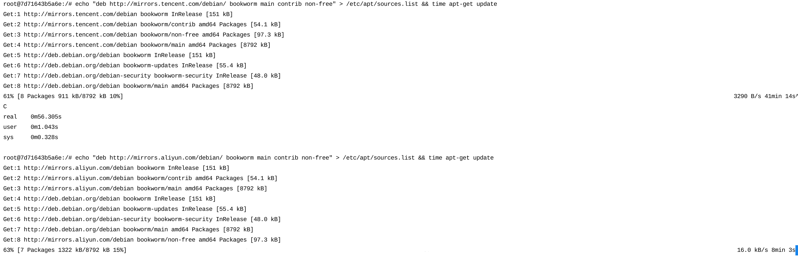

今天要把一直做的项目部署到腾讯云一版，原本以为半天的工作量，最后从上午十点搞到晚上八九点，遇到了很多必须立刻记下来否则明天起床就忘了的问题。我不想谈论项目本身，只从技术角度展示所遇到的报错和对应的解决方案，有些问题我不是特别清楚为什么可以使用那种方案解决，但人在江湖、也没时间去深究了。

需要说明的是，之前为了避免这些糟心的问题，我做的一些 Demo 项目一直是在外面的服务器上部署的。但我知道迟早会有面对疾风的一天，所以它还是来了。

如前所述，本项目是基于以下环境开发的：

```bash
ruby -v
# ruby 3.4.1 (2024-12-25 revision 48d4efcb85) +PRISM [x86_64-linux]

rails -v
# Rails 8.0.1

rails new xxx -c tailwind -j esbuild -d mysql
```

部署所用的 Dockerfile 也是基于 Rails 自动生成的文件所修改，只是自己添加了以下文件：

- `docker-compose.yml`
- `.env`
- `config/caddy/Caddyfile`
- `docker/mysql_init.sql`
- `lib/tasks/multi_db.rake`

**我尽量回忆每个问题我尝试了怎样的方式去解决的，但回忆未必完整，也不必要，所以只捡重要的记一下，最后列出解决方案**。

## 1. 安装 Docker

要部署的服务器是 Ubuntu，按照 [https://cloud.tencent.com/document/product/213/46000](https://cloud.tencent.com/document/product/213/46000) 安装 Docker 没有遇到什么问题，似乎安装 Docker 会自动安装 Docker Compose。

## 2. 网络问题

毫不奇怪这是第一个问题，虽然早有准备，但依然花了很多时间在这个问题上。Dockerfile 是基于 `ruby:3.4.1-slim` 的：

一开始我误以为这个镜像基于 Ubuntu，所以按照下面的方式直接修改了 apt 源：

```dockerfile
RUN sed -i 's/archive.ubuntu.com/mirrors.tencent.com/g' /etc/apt/sources.list && \
    sed -i 's/security.ubuntu.com/mirrors.tencent.com/g' /etc/apt/sources.list && \
    apt-get update -qq \
    # ...
```

但镜像构建速度很慢，慢到不合理。然后我查看 Docker Hub 发现它基于 Debian，所以换源代码改成了：

```dockerfile
RUN echo "deb http://mirrors.tencentyun.com/debian/ bookworm main contrib non-free" > /etc/apt/sources.list && \
    echo "deb http://mirrors.tencentyun.com/debian-security/ bookworm-security main contrib non-free" >> /etc/apt/sources.list && \
    echo "deb http://mirrors.tencentyun.com/debian/ bookworm-updates main contrib non-free" >> /etc/apt/sources.list && \
    apt-get update -qq && \
    # ...
```

但还是很慢，用 `echo "deb http://mirrors.tencentyun.com/debian/ bookworm main contrib non-free" > /etc/apt/sources.list && time apt-get update` 在容器里测试，结果如下图：



我看到上图右侧的 41 分钟时是有点慌乱的，甚至换成阿里云的镜像尝试了一下，8 分钟当然也是不可接受的。但我冷静了一下发现图中没有完全走源，所以**最后的解决方案是**：

```dockerfile
RUN echo "deb http://mirrors.tencentyun.com/debian/ bookworm main contrib non-free" > /etc/apt/sources.list && \
    echo "deb http://mirrors.tencentyun.com/debian-security/ bookworm-security main contrib non-free" >> /etc/apt/sources.list && \
    echo "deb http://mirrors.tencentyun.com/debian/ bookworm-updates main contrib non-free" >> /etc/apt/sources.list && \
    # 把可能存在官方源的文件删除
    rm -f /etc/apt/sources.list.d/* && \
    apt-get update -qq && \
```

> 腾讯云软件源加速软件包下载安装和更新 (也包含了 RubyGems 源): [https://cloud.tencent.com/document/product/213/8623](https://cloud.tencent.com/document/product/213/8623)

除此之外，Gem 的源是早早设定的，没有相关的报错：

```dockerfile
RUN gem sources --add https://mirrors.cloud.tencent.com/rubygems/ --remove https://rubygems.org/ && \
    bundle config mirror.https://rubygems.org https://mirrors.cloud.tencent.com/rubygems/
```

## 3. 找不到 `net-smtp` gem

这个问题就不得不提一句 Ruby 官方最近喜欢从标准库里删东西，之前有一次我更新版本后发现 `SortedSet` 没了，一查是官方从标准库移除了，这次也是。

构建过程的报错是 `Could not find net-smtp-0.5.0 in locally installed gems (Bundler::GemNotFound)`，前几天我在 GitHub CI 里已经遇到并做了修复，方法是在 Gemfile 里添加 `gem "net-smtp", "~> 0.5.0", group: :test`。

这次既然又报这个错误，我就把 `group: :test` 删除了，但构建之后仍然报错。我去看了一下 `net-smtp` 的仓库， `0.5.0` 和 `0.5.1` 版本之间差了十个月左右，考虑到 Ruby 3.4.1 也是最近才发布，我修改了 `net-smtp` 的版本，所以**最终的解决方案是**： `gem "net-smtp", "~> 0.5.1"`。

因为不确定是不是还有 bundle 的问题，所以我一并修改了 bundle cache 相关的构建命令：

```dockerfile
# Install application gems
COPY Gemfile Gemfile.lock ./
RUN bundle config set --global path "${BUNDLE_PATH}" && \
    bundle config set --global without "${BUNDLE_WITHOUT}" && \
    bundle install --jobs=4 --retry=3 && \
    rm -rf "${BUNDLE_PATH}"/ruby/*/cache && \
    bundle exec bootsnap precompile --gemfile
```

## 4. `./bin/rails: Permission denied`

这是继续构建镜像遇到的下一个报错，很明显，`bin` 目录内的 `rails` 文件没有权限，于是我在 Dockerfile 的某个合适的位置添加了 `RUN chmod +x bin/*`，对 `bin` 目录内的所有文件都赋予执行权限。

## 5. `chmod: cannot access '/rails/bin/docker-entrypoint': Permission denied`

上面的修改给 `bin` 目录内的所有文件都添加了执行权限，但是依然遇到了这个报错，看起来不是执行权限的问题，而是用户甚至没有权限访问这个文件。

查看 Dockerfile 发现修改权限之后，镜像后来又从 `root` 用户切换到了 `rails` 用户。所以改成在多阶段构建的最后一个阶段添加权限：

```dockerfile
RUN chmod +x /rails/bin/docker-entrypoint && \
    chown -R rails:rails /rails/bin/*
```

## 6. `chown: invalid user: ‘rails:rails’ `

这个报错的原因完全是上一步做的不对，因为我把添加权限的命令放到了创建 `rails` 用户之前，所以我调整了一下顺序：

```dockerfile
# 必须先创建用户和组
RUN groupadd --system --gid 1000 rails && \
    useradd rails --uid 1000 --gid 1000 --create-home --shell /bin/bash

# 然后设置权限
RUN chmod 755 /rails/bin/docker-entrypoint && \
    chown -R rails:rails db log storage tmp

USER 1000:1000
```

## 7. `cannot load such file -- /rails/config/boot (LoadError) from ./bin/rails:3:in '<main>'`

然后遇到了这个报错，可以很确定的是 `config/boot.rb` 文件是存在于镜像内的，但没有被加载应该还是权限的问题，我观察到上一步的 `chown -R rails:rails db log ...` 中，并没有给 `rails` 用户 `/rails` 目录的权限，所以**综合 4-7 关于权限的最终解决方案是**：

```dockerfile
RUN groupadd --system --gid 1000 rails && \
    useradd rails --uid 1000 --gid 1000 --create-home --shell /bin/bash && \
    chmod 755 /rails/bin/docker-entrypoint && \
    find /rails/bin -type f -exec chmod 755 {} + && \
    chown -R rails:rails /rails db log storage tmp
USER 1000:1000
```

到此为止，镜像总算是构建成功了。下面遇到了新的问题。

## 8. `HTTP Origin header (http://<ip>) didn't match request.base_url (https://<ip>)`

登录页面的时候遇到了这个报错。

因为暂时没有绑定域名，所以计划是先用 IP 访问，由于 Caddy 和 Rails 默认都启用 SSL，所以需要先关闭设置，最终修改的 Caddyfile 和 Rails 配置分别如下:

```caddyfile
# config/caddy/Caddyfile

# Caddyfile 临时配置
http://<your_tencent_ip_address> {
    reverse_proxy app:3000 {
        header_up X-Forwarded-Proto {scheme}
    }
}
```

```ruby
# config/environments/production.rb

# ...
config.assume_ssl = false
config.force_ssl = false
config.ssl_options = { hsts: false }
```

## 9. `ActiveRecord::StatementInvalid (Mysql2::Error: Table 'xxx_db.solid_cache_entries' doesn't exist)`

最后一个报错是数据库问题，众所周知，Rails 8 默认使用四个数据库，除了主数据库之外，还有 cache、queue、cable。

我原本想着后面三个数据库数据量很小，把这四个数据库放到一个数据库里，但设置起来也是一番波折，而且如果以后需要再拆分出来，也许还要费功夫，所以还是按照官方推荐使用四个数据库。

Dockerfile 中 `/docker-entrypoint` 执行了 `db:prepare` 命令，但后面三个数据库确实没被创建，也许 `db:prepare` 只针对主数据库？但 `solid_cache` 仓库的文档里确实说只要如此这般设置 `config/database.yml` 然后再运行 `db:prepare` 就可以了，参考下面的链接：

> [https://github.com/rails/solid_cache?tab=readme-ov-file#installation](https://github.com/rails/solid_cache?tab=readme-ov-file#installation)

但这后三个数据库的确没有被创建，所以我的方案是让 MySQL 自己创建，MySQL 的 DockerHub 链接 [https://hub.docker.com/_/mysql](https://hub.docker.com/_/mysql) 里有这样一段话：

> When a container is started for the first time, a new database with the specified name will be created and initialized with the provided configuration variables. Furthermore, it will execute files with extensions `.sh`, `.sql` and `.sql.gz` that are found in `/docker-entrypoint-initdb.d`. Files will be executed in alphabetical order.

所以把创建数据库的语句通过 Volume 放到 MySQL 镜像的 `docker-entrypoint-initdb.d/` 目录内就会自动创建了。相关的文件修改如下：

数据库配置文件：

```yml
# config/database.yml

# ...
production:
  primary: &primary_production
    <<: *default
    url: <%= ENV["DATABASE_URL"] %>
  cache:
    <<: *primary_production
    url: <%= ENV["SOLID_CACHE_DATABASE_URL"] %>
    migrations_paths: db/cache_migrate
  queue:
    <<: *primary_production
    url: <%= ENV["SOLID_QUEUE_DATABASE_URL"] %>
    migrations_paths: db/queue_migrate
  cable:
    <<: *primary_production
    url: <%= ENV["SOLID_CABLE_DATABASE_URL"] %>
    migrations_paths: db/cable_migrate
```

Docker Compose 配置文件：

```yml
# docker-compose.yml

services:
  app:
    build:
      context: .
      args:
        RUBY_VERSION: 3.4.1
    environment:
      RAILS_ENV: production
      RAILS_MASTER_KEY: ${RAILS_MASTER_KEY}
      DATABASE_URL: mysql2://${DB_USER}:${DB_PASSWORD}@db/${DB_NAME}
      SOLID_CACHE_DATABASE_URL: mysql2://${DB_USER}:${DB_PASSWORD}@db/${DB_NAME}_cache
      SOLID_QUEUE_DATABASE_URL: mysql2://${DB_USER}:${DB_PASSWORD}@db/${DB_NAME}_queue
      SOLID_CABLE_DATABASE_URL: mysql2://${DB_USER}:${DB_PASSWORD}@db/${DB_NAME}_cable
    depends_on:
      db:
        condition: service_healthy
    networks:
      - backend

  db:
    image: mysql:8.0
    command: --default-authentication-plugin=mysql_native_password
    environment:
      MYSQL_ROOT_PASSWORD: ${DB_ROOT_PASSWORD}
      MYSQL_DATABASE: ${DB_NAME}
      MYSQL_USER: ${DB_USER}
      MYSQL_PASSWORD: ${DB_PASSWORD}
    volumes:
      - mysql_data:/var/lib/mysql
      - ./docker/mysql_init.sql:/docker-entrypoint-initdb.d/init.sql
    # ...
```

映射到 MySQL 内的自动创建数据库的 SQL 文件：

```sql
-- docker/mysql_init.sql

-- 创建附属数据库
CREATE DATABASE IF NOT EXISTS `xxx_db_cache`;
CREATE DATABASE IF NOT EXISTS `xxx_db_queue`;
CREATE DATABASE IF NOT EXISTS `xxx_db_cable`;

-- 授予用户权限
GRANT ALL PRIVILEGES ON `xxx_db`.* TO 'xxx_user'@'%';
GRANT ALL PRIVILEGES ON `xxx_db_cache`.* TO 'xxx_user'@'%';
GRANT ALL PRIVILEGES ON `xxx_db_queue`.* TO 'xxx_user'@'%';
GRANT ALL PRIVILEGES ON `xxx_db_cable`.* TO 'xxx_user'@'%';
FLUSH PRIVILEGES;
```

还可以给它们写一个迁移文件：

```ruby
namespace :db do
  task :multi_migrate => :environment do
    Rails.application.configure do |config|
      config.paths.add 'db/cache_migrate', eager_load: true
      config.paths.add 'db/queue_migrate', eager_load: true
      config.paths.add 'db/cable_migrate', eager_load: true
    end

    Rake::Task['db:migrate:primary'].invoke
    Rake::Task['db:migrate:cache'].invoke
    Rake::Task['db:migrate:queue'].invoke
    Rake::Task['db:migrate:cable'].invoke
  end
end
```

需要时可以通过 `docker compose exec app bin/rails db:multi_migrate` 执行迁移。

最后清理 Volumes 并重新运行 Docker Compose:

```bash
docker compose down -v # 非不要不执行
docker compose up -d --build
```

## 10. 总结

之前的开发中也做过运维相关的工作，大都是站在巨人的肩膀上一知半解。这算是第一次在这种环境下独立部署，层出不穷的报错一度让人无比沮丧，但好在坚持不懈最终一一解决。

虽然遇到的问题已经解决了，但还有更多亟待提高和优化的地方，比如：

- 设置 GitHub Actions 自动部署
- MySQL 的定期备份
- Caddyfile 在生产中的进一步调优
- 很多需要优化的实现
- ...

不过最近越来越明白的一个道理是**欲速则不达**，遇到问题时先从简单、通用的方案着手解决，**先做出来一个可行的方案**，然后一点一滴的优化它才是王道。这次的项目虽然不大，但是我独立完成前端、后端、测试、运维的所有工作，和这种思维是分不开的：

- 我克制了使用 Kamal 的想法，选择了 Docker Compose
- 克制了前端花哨的组件，选择了简单的 HTML/TailwindCSS
- 克制了功能繁多的 Gem，选择尽量自己实现功能
- 抛弃了纠结许久的 ChartKick，选择了直面 Chart.js
- ...

诸如此类的选择，让我对代码拥有更多的控制力，也对解决方案有了进一步的认识：所谓**大道至简**。
